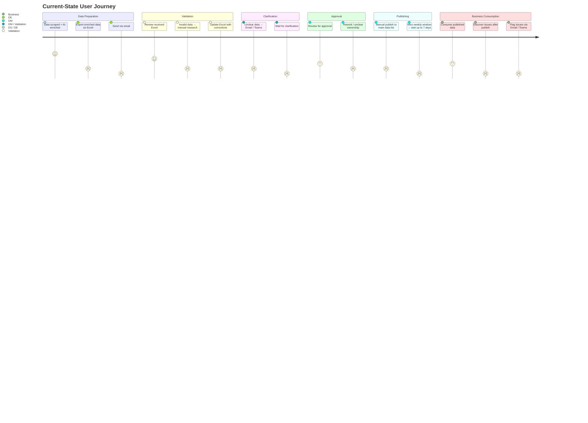

# Current-State User Journey - Where the Problem Lives
I mapped the end-to-end journey across all actor lanes before proposing any solution. This gave precise visibility into where catalog velocity was being destroyed - not just that it was slow.

## User Journey Flow
| Actor | Step | Problem Hotspot |
| ------ | ------- | ---------- |
| DS/DE | Data scraped and AI-enriched | - |
| DE | Export enriched data as Excel → send via email | 🔴 Handoff failure point. No versioning, no timestamp, no way to know if received file is current. Every version confusion adds delay. |
| Validation | Review data in received Excel | - |
| Validation| Data invalid → manual research via Google + Excel update | 🔴 Role boundary collapse. Validation team doing upstream enrichment work. Slows the cycle and introduces inconsistent corrections. |
| DM Validation | Unclear data → clarify via Email / Teams | 🔴 All resolution happens out-of-band. No SLA, no tracking, no visibility. Products sit in limbo for unknown durations. |
| DM | Review for approval | 🟡 Repeated rework with unclear ownership. The same product may be touched by multiple people without a single source of truth for what state it is in. |
| DM | Manual publish to main data list | 🔴 Publish is manual. Any product that reaches this step after the weekly cycle window has closed waits until the next cycle - minimum 7-day delay regardless of readiness. |
| Business | Consume published data → discover issues → flag via Email / Teams | 🔴 Post-publish discovery means products with errors have been active in the catalog. Downstream teams adapt by working around the data - eroding catalog trust and suppressing usage. |

## User Journey Diagram
