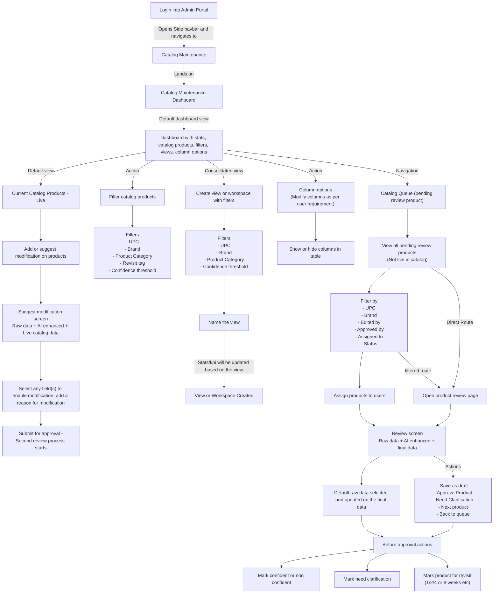
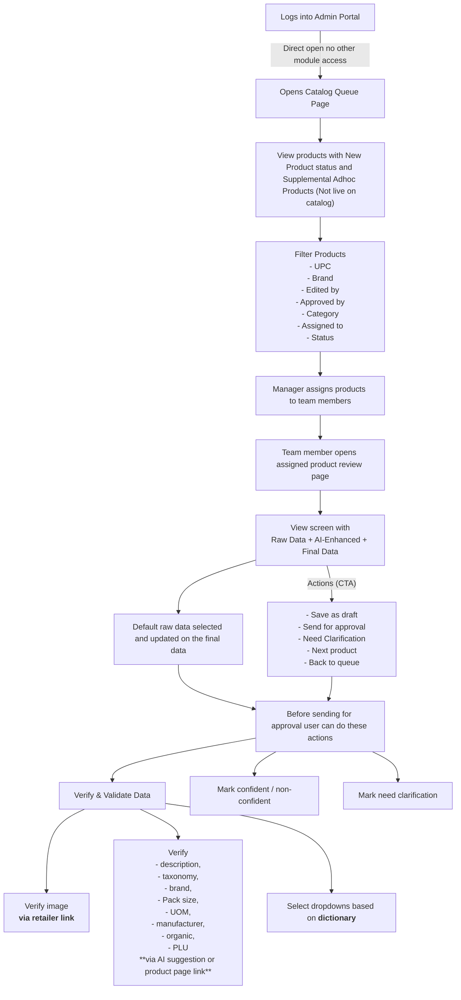

# Catalog Maintenance

## What this is?

A centralized workflow for reviewing, cleaning, and approving new syndicated product data and correcting issues in existing catalog products.

## Why this is a pain?

Due to lack of proper process & a clear path, currently **data management**, **data scrapping**, **product management** and **business teams** rely on manual, fragmented processes, leading to inconsistent product data quality, higher operational effort, and reduced trust in the catalog.

## Identified Problems

- **Poor Data Quality at Ingestion**
  - Scraped syndicated product data is incomplete, inconsistent, or incorrect

- **No Structured Review Workflow**
  - There is no centralized place to review, correct, and approve new products

- **No Feedback Loop for Existing Catalog Issues**
  - Business or sales teams notice issues but have no formal way to report or fix them

- **High Manual Effort & Slow Turnaround**
  - DM team spends too much time:
    - Comparing raw vs cleaned data
    - Fixing repetitive issues

## Expected Outcome

- Increase in Data Quality/Confidence Score by 5-10%
- Increased Trust on Catalog Products by 5%
- Reduction in manual workflow by 15-20%
- Better feedback resulting in 3-5% improved catalog and reduced operational effort by 10-15%

## Key Features & Workflows

### Key Features

- Centralized Catalog Maintenance Page
- Ability to request changes/modification of the catalog product.
- Check the overall product catalog Confidence Score and Individual product Confidence Score
- Review Products with more data and clarity

### Workflows

- Business Team & Data Management team will have full access to the catalog Maintenance module
- Below are the mentioned access and capabilities available:
  - **Catalog Maintenance Dashboard** - includes`Stats`, `Filters`, `View or Workspace Creation` and `Catalog product list`.
  - **Request Modification** - to suggest any modification to the live catalog products with a reason to back the modification.
  - **Catalog Maintenance Queue** - to see the list of products which are currently under review or pending review, includes `Filters`, `list of products`, `assignment cta`.
  - **Product Review** - to review the product and approve the product with final data.

- Product Review Team will have access to only the catalog Maintenance module
- Below are the mentioned access and capabilities available:
  - **Catalog Maintenance Queue** - managers will assign products to the team members for review and data verification. Once assigned the team member will filter the products assigned to them.
  - **Product Review** - to review the product and send the product for approval with final data(Verified).

### Workflow Diagrams

### Business Team

#### Click to Open [Mermaid Link (Click to Open)](https://mermaid.live/view#pako:eNqdVttO40gQ_ZWSpZFAmwAGEiAPKwUnQCA3coHV2kjTsTuOhdOd6W7DsIR_36r2BdAw-7Avibtdl1N1TlXy6oQy4k7LqdfrgTCJSXkLzjOdCK41zDhbw71Uj8tUPgfC2tBjuGLKwKwTiEC0_b6MEwGJMBJ6wqgk1NCO1ng1lsqw9AFtoF7_czvacKFhmkQcBHtaMAVMRPSYxMxwDUZu4dz3GPrIGAYMI3LBRMgxwrmN0EcHDVJswfvKDjpMrxaSqQg9POvR4UuWpQai8g08Jfx5Cx2_soXnxKxAG2Z0DcIi6kbJKAvpZpmkhit8IEeykGm2FiA3JpFCP1ALvn2Dfvdi1gIvU4oLAyW2cRElEJ1PaHIMXf939lCHfvJEdXfJDy78dhSBVKCzOObawFpGyTJBsIgB-1HBRY8L63HpB8736VfWOlScCwjEhD1jWwyDP6DdAy5W1MIIT5S6agRZfA8cDHxpA19h4ClPeWiQvRfsDk-jHb2L5GEItkj5p2w1YAicgeJMY-4llvDxtY17ZeP2csCLdWKsGdtgTU8sxVYEYspDiVJRnBpHxYakTqRMGZ2DsyRc9Pqz7gTGk1Fn7s2mZdfbIeXawrV_Ybn8hWT0v7Ygrl1CkVshaXWYjz36OlcoPHooCCLCeCzVC91NEJVG1IbFdPSkWKLESY5mpbheyTT6gNGbdNuzLtz1uvewD_ejyc103Pa6JVb01jJNsOu8lOqN72H7DLdHEsEzDqTeMExglVsIFBPc2CJu_k8Rv0d94-ZRD_0hW9PbHAi9ObSQpzQ5-4-bBOGkKSw4ZJsc_4Jp_ETeSycs5si_K8q4r8rI64uqFo3688EQRuNZbzT8hcU-Ved9GkJUyM6AZPVSTKcGpmGDTGcaPxT_kSWKr3HSdvOa-rakvutPV9JiWdFSKn1xcxlScoln0ru8ouFuz9r90SXczrvziq9hvr0ssgEiKyf5NuMZhx3ceFEi4g_Kpc7vWhADC2JI5diWMGze1_bI4s5QGkhpMBFdod-imKGNM3onHRYvX9HejRJLin3ZtuP1ftQ6iQUejaQjUZpVkzWyCcZ-blSBopGn_pLyrMk2VyJGUTIzfAu3Pq380qEqisV5a8c27oSAT_JX-W76j9W0TASuhPeddJuHKJqw7SDNmGhSpC_569ppa3uFnibWaeqX21iV2bTda5iIfpdKERfyfc_8UEQoFKm3MKMS6lOG7KDuIsWWxnYRyfy0y-hyyH-asiOWHhY-Uid_kGDyoqYW3zwQs_zBP-cYhb-vRBaWvz1za3HnD5h6RP3mM2xI0QJxVxeV5X1uKTgWFqZMVZu4svgLa7E2JWtUgMpXHMrQ3T_cP6b4p_DM-aMGbkKSs1NzYpVETsuojNecNVdrRkfnNRAAgYMtXPPAaeFjlLc9cALxhm4bJv6Wcl16onTildNaslTjKSehk7BYsXcT7CtXnsyEcVoNG8FpvTo_nVbzcK954rrHB42jxsHpyVmz5rw4Lddt7B0cnNB18_TAbZwdvdWcf2xOd89tNN2T07OGe9g8Oj48Oak5HOdEqkH-t8j-O3r7F5SGGqQ)

#### Diagram

### DM Team

#### Link [Mermaid Link (Click to Open)](https://mermaid.live/view#pako:eNqdVllP40gQ_islSyOBNoEcHEMeVgpOYAK5yAGrtZGmY3ccC6c7090mwxL--1a1j4CG2Yd9SdzuOr6q76tKXp1AhtxpOdVq1RcmNglvQYcZBgMmWMTXXBiYcbaGB6melonc-sKa0mOwYgpvO77wRdvryygWEAsjoSeMigMN7XCNr8ZSGZY8og1Uq3_uRhsuNEzjkINgzwumgImQHuOIGa7ByB1cei5iSGSEMDAiF0wEHCNc2gh9dNAgxQ7cz-wQv14tJFMherjWo8OXLE0MhMUNPMd8u4OOV9rCNjYr0IYZXYEgj7pRMkwDerOME8MVPpAjWcgkXQuQGxNLoR-pBV--QL97NWuBmypFfSuwjfMovuh8QJNh6Hq_s4cq9ONnqrtLfnDltcMQpAKdRhHXBtYyjJcxgkUM2I8SLnpcWY9rz3e-Tz-z1oHiXIAvJmyLbUHC_4B2D7hYUQtDPFHqshFk8d13MPC1DfwNA095wgOD7L1gd3gSHuhDJA9DsEXCP2SrAEPgDBRnGnMvsYT31zbuNxu3lwFerGNjzdgGa3pmCbbCF1MeSJSK4tQ4KjbgWhNlyugMnCXhqtefdScwnow6c3c2LbreDijXDm68K8vlLySj_40FcVMnFJkVklaF-dilr0uFwqOHnCAijEdSvdC7CaLSiNqwiI6uFEuUOMnRrBTXK5mE7zC6k2571oX7XvcBjuFhNLmdjttut8CK3lomMXadF1K99Vxsn-H2SCLY4kDqDcMEVrm5QDHBrS3i9v8U8XvUt_UsasMbsjXdZkDopmEhT2lyjp82McJJElhwSDcZ_gXT-Im8F05YTNO7z8t4KMvI6gvLFo3688EQRuNZbzT8hcU-Ved-GEJUyMGAZPWST6cGpmGDTKcaPxT_kcbKbrTDrKa-Lalf96YrabGsaCkVvri5DCm5wDPpXX-j4W7P2v3RNdzNu_OSr2G2vSyyASIrJvku5SmHA9x4YSyid8qlzh9aEAMLYkjl2JYwbN7n9sjiwVAaSGgwEV2u37yYoY0z2pMOi5fPaO-GsSXFXrbteO2PWseRwKORdCRK03KyRjbB2MuMSlA08tRfUp412WVKxChKpobv4M6jlV84lEXhr4uNO7ZxJwR8kl1lu-k_VtMyFrgS9jvpLguRN2HXQZox0SRPX_DXtdPWdnM9TazT1Cu2sSqyabvXMBH9LhUizuW7z_yYR8gVqXcwoxKqU4bsoO5CxZbmXY-LeaNXQ_7TFP2w5LDgifr4g-SSlTS16Oa-mGUP3iXHfcj3C5EFxS_P3FrcewOmnlC92QQb0rNA1OWL0vIhsxQcywoSpso9XFr8hZVYm4IzWsUqW3Aowvpx4_iE4n-FLedPGrgJSMxOxYlUHDoto1JecdZcrRkdnVdfAPgONnDNfaeFj2HWdN_xxRu6bZj4W8p14YnCiVZOa8kSjaeMgk7MIsX2JjgiXLkyFcZpndoITuvV-em0qs1G7ahRazYatXqjdt6o1c4qzgu-P2tcHNWb5_Wzi9pJs3H69eyt4vxjs9aPLk4umqeN-slp_eK0VjuvOBzHRKpB9ufI_kd6-xd9xhxh)

#### Diagram

### Product Review Team

#### Link [Mermaid Link (Click to Open)](https://mermaid.live/view#pako:eNptVNtSGzEM_RWNHzo0JJSQex46ExIooVzScnlolpmaXWXjYVfe2t5ACvx7ZW8C7Uyf1pJ1dKQjrZ9FrBMUQ5EaWSzhehLRaH6mUwuKnIYpOaNiC6MkVwQzbZzM7qDR-PwyUQZjB7pAAtKg3RIN5DopMwQZx2jtCxzOL_nawlgyTKfwrcQSYSZTvIvo0KeB8TwStwofoTCMjZ2FR-WWcMGeWeUB66QrLUhK4KosigxzJM7HNS11vI2ysHOhHWRqhaAJ4orxYySYaRyYJsz081hljuvcgiJqwM1s7D-Hhgn84ShRDhO4X3tjVHBdqzeTG8FUm-rKWpUSXzntzatQ5c9AGNEkUB7NzyVxtwZkCLbvXbK2DmUOOeb3aCyDjgLkeH797g7q2g2YmTZoMLgKklVCRnQcoF-2UtrYIE_FCxnRd_kIE1YDdmE0bRzRUlLMqXbhWBGL6K82NX8JWU7mE1zIMmMWRiYeaTHjUTPIj6As2MdnFplHDouQxYfdbTK8RGIUO6W58J3x9YhH8AJTr31QSfJ8pIXEyIULDuScC80KBaVl5p0XyATjTBq1UDxJzlV5n9xWgjAxGT94HX_5rdoKfxKaOJ0fIidFLp0SRek_DFBaljaWBIn2PVi_sKFgzjCt8D7VaTh-nd8i17GGD3ArM-WbD6LdbQPOeMjmAWJNC5XwZsIn_h-o8Wa_BZ5XgeSbi_9uLhT-tWJreqU2jCrnAUNEtdpKSR66kyrjyjNFD7Va1fAGdfCO8sokyCugCp-77m0nnzTpfB2Me7_o4TTzAlr1G4N1c3kevrmkcsGClAZNcGiTSlJxBTm72dYzmoIt0xStp-Ggt-30a_m_Ilu-yKuwSzx_XST6kXfkXtpqm2q1RIUxSLOukKLOr5JKxNCZEusiR5NLb4rniAAiwbPLMRJDPibVzkYioleGFZJ-aJ1vkUaX6VIMFzKzbFUbPFGSn7z3EF4UNGNdkhPDTsgghs_iSQz7-3uddre3P-i02_1Wd3BQF2sxbDTbrb1et9_s9nv9TnfQb_Vf6-J3IG3uNQftg0Gz19zvd1qdXrdXF8ivijbn1VsbntzXP9hT1hs)

#### Diagram

## Artifacts & Resources

### Ideation Prototype

[Prototype Link (Click to open)](https://arkdezin.github.io/catalog/)

> _Note: This is not final design, just for understanding the concept and workflow._
